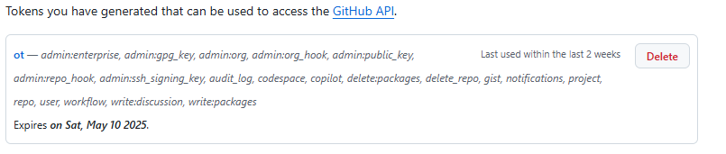

# VCS Authentication POC

| Author | Created on | Version | Last updated by | Internal Reviewer | Reviewer L0 | Reviewer L1 | Reviewer L2 |
|------------|---------------------------|-------------|---------------------|-------------|-------------|-------------|-------------|
| Dipanshu Rawat |   15-02-2025             | v1          | Dipanshu Rawat       |  Siddharth Pawar |  |   |      |


# Table of Contents

- [Introduction](#introduction)  
- [Understanding Git Authentication](#understanding-git-authentication)  
- [Pre-Requisites for Git Configuration](#pre-requisites-for-git-configuration)  
- [Step-by-Step Setup Guide](#step-by-step-setup-guide)  
- [Best Practices for Git Authentication](#best-practices-for-git-authentication) 
- [Conclusion](#conclusion)  
- [Contact Information](#contact-information)  
- [References](#references)  


## Introduction
Authentication verifies the identity of a user or system, ensuring that only authorized individuals can access resources. It's like a gatekeeper, allowing entry only to those who prove their identity. This process often involves methods such as passwords, SSH keys, tokens, or MFA.


## Understanding Git Authentication
In Git, authentication ensures that only authorized users can access repositories and make changes to them. The following methods are commonly used for Git authentication:

| No. | Method                | Description                                                               |
| --- | --------------------- | ------------------------------------------------------------------------- |
| 1   | SSH Keys              | Uses secure key pairs to authenticate users without needing a password.  |
| 2   | Personal Access Tokens (PATs) | Provides a secure token for access with specific permissions.           |
| 3   | OAuth Tokens          | Allows login using third-party services for easier authentication.       |

## Pre-Requisites for Git Configuration

| No. | Requirements        |
|-----|--------------------------|
| 1.  | Operating system    ( Windows/Mac/Linux )|
| 2.  | Hardware Memory(512 MB of RAM ) |
| 3.  | 	Disk Space (At least 100 MB for installation ) |
| 4.  | 	Git installation |
| 5.  |   Git Configuration |

## Step-by-Step Setup Guide

### How to Create and Use a Personal Access Token for Authentication
### Step 1: Generate a Personal Access Token:-

- **Access Account Settings**:  
  Log in to your GitHub account. Click on your profile picture in the top-right corner and select **"Settings"** from the dropdown menu.


- **Navigate to Developer Settings**:  
   In the left-hand menu, scroll down and click on **"Developer settings"**. Then, choose **"Personal access tokens"**.


- **Generate a New Token**:  
   Click on the **"Generate new token"** button to create a new token.

- **Authenticate Yourself**:  
   Enter your GitHub password to confirm that you have the authority to create a new token.


- **Name the Token**:  
   In the **"Note"** field, provide a meaningful name for the token (e.g., "Git operations token") to help you identify its purpose later.


- **Choose Permissions (Scopes)**:  
   Select the required permissions for the token. For Git-related tasks, enable the **"repo"** scope to allow access to your repositories.


- **Generate and Save the Token**:  
   Scroll down and click the **"Generate token"** button.  


- **Copy the Token**:  
   Once the token is displayed, copy it immediately and save it in  a secure location (e.g., a password manager).   


**Note**: This token will only be shown once. If you lose it, you will need to generate a new one.


### Step 2:- Git Configuration and Pushing with Personal Access Token:-


 1. **Open a Terminal (Command Prompt):-**
     
    - Open the terminal on your system.

 2. **Set up your Git username and email:-**
   
     ``` bash
     git config --global user.name "Your Name"
     git config --global user.email "your_email@example.com"
     ```
  - This configures your Git with your personal details, which   will be associated with your commits.

 3. **Verify the configuration:-**
  
    ``` bash
    git config --list
    ```
  - This command will show you the settings to confirm that your username and email have been configured correctly.

  
 4. **Clone the Repository using HTTPS and use Personal Access Token:-**

 
- Use the HTTPS URL of the repository.

 ``` bash 
 git clone https://github.com/username/repository.git

```
5. **Push changes to the repository:-**


  - After making changes to your repository, use git push to push  the changes to the remote repository.

 ``` bash
 git push origin main
```

- When prompted for your username, enter your GitHub username.
- When prompted for the password, use your Personal Access Token (not your GitHub password). The token is used instead of your password for security purposes


## Best Practices for Git Authentication


- **Use Strong, Unique Passwords:-**
Avoid using easily guessable passwords and do not reuse passwords across multiple sites or services..

- **Enable Two-Factor Authentication (2FA):-**
Adding an extra layer of security with 2FA ensures that even if your password is compromised, the attacker still can't access your Git repository without the second authentication factor.

- **Use Personal Access Tokens (PATs) for HTTPS:-**
PATs are a safer alternative to using passwords for HTTPS Git operations. They are more secure, can be scoped to specific permissions, and can be revoked if compromised.


## Conclusion 
Git, a popular version control system (VCS), supports various authentication methods for secure repository access. Common methods include SSH keys, HTTPS with username and password, and personal access tokens. These ensure secure and authenticated interactions, maintaining code integrity and enabling efficient collaboration across development teams.


## Contact Information

| **Name** | **Email address**            |
|----------|-------------------------------|
| Dipanshu Rawat   |  dipanshu.rawat@mygurukulam.co          |

##  References

| Links | Description      |
|-----  |--------------------------|
| https://www.squash.io/how-to-authenticate-git-push-with-github-using-a-token/  |  For step by step guide for git personal acess token    | 


