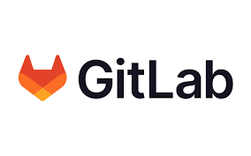
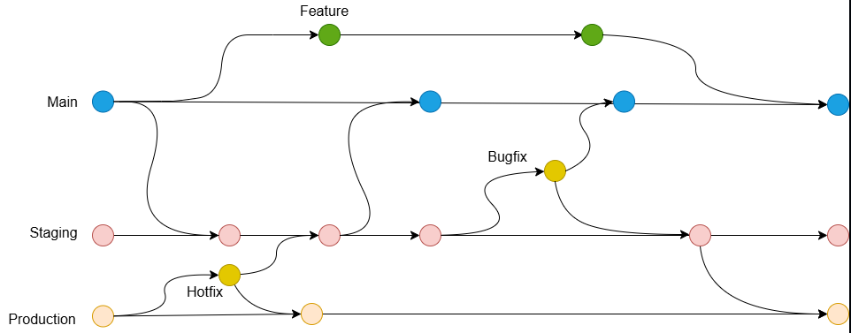

# GitLab Flow Documentation

---
| **Author** | **Created on** | **Version** | **Last updated by**|**Internal Reviewer** |**Reviewer L0** |**Reviewer L1** |**Reviewer L2** |
|------------|---------------------------|-------------|---------------------|-------------|-------------|-------------|-------------|
| Dipanshu Rawat|   13-02-2025             | v1          | Dipanshu Rawat        |  Siddharth Pawar |  |   |      |

---
## Table of Contents
1. [Introduction](#introduction)
2. [Diagram](#diagram)
3. [GitLab Flow](#gitlab-flow) 
4. [Why GitLab Flow](#why-gitlab-flow)
5. [Advantages of GitLab Flow](#advantages-of-gitlab-flow)
6. [Disadvantages of GitLab Flow](#disadvantages-of-gitlab)
7. [Conclusion](#conclusion)
8. [Contact Information](#contact-information)
9. [References](#references)
---

## Introduction

The GitLab Flow is a branching and deployment strategy that emphasizes simplicity and flexibility while aligning with the CI/CD workflows of GitLab. It serves as an alternative to the more complex Git Flow and focuses on integrating continuous development, delivery, and deployment.

---

## Diagram

---

## GitLab Flow

The role of the main branch as a stable, deployable branch.
Usage of feature branches for developing new features or bug fixes.

### Workflow steps:

- The diagram represents different branches:

  - Master (Main) → The stable, production-ready branch.
  - Feature Branch → For developing new features.
  - Bugfix Branch → For fixing issues before merging back.
  - Staging Branch → For testing before production.
  - Hotfix Branch → For urgent fixes applied directly to production.
  - Production Branch → The final, deployable version.
  
---
## Why GitLab Flow?

GitLab Flow aims to simplify the development process by combining the best aspects of feature branching, issue tracking, and CI/CD practices into one unified approach. The primary reasons to adopt GitLab Flow include:

- Clear & Organized Collaboration: Feature branches, hotfix branches, and staging branches ensure a structured workflow. Teams can work on new features, fix bugs, and test code before merging into production.
- Simplified Workflow: By streamlining branching strategies and integrating issue tracking into the workflow, GitLab Flow makes it easier for teams to collaborate and stay on the same page.
- Improved Automation: With CI/CD pipelines automatically triggered by GitLab Flow's branching model, deployments and tests become automated, reducing manual overhead.

---

### Advantages of GitLab Flow

|Advantages|Description|
|--------|---------|
|Integrated Development| Cycle	Combines Git, CI/CD, and issue tracking in one platform for a seamless development experience.|
|Better Collaboration	|Enables effective collaboration with integrated issue tracking and merge requests.|
|Faster Releases	|Automation and CI/CD pipelines enable quicker, more frequent, and confident deployments.|
|Consistency	|Standardized environment and branch structures ensure uniform processes across stages.|
|Quality| Control	Automated testing and peer code reviews before merging improve code quality.|

---
### Disadvantages of GitLab Flow

|Disadvantages	|Description|
|------------|------------|
| Potential Merge Complexity | Can become cumbersome for larger teams with frequent merges, increasing the risk of merge conflicts and requiring more attention to conflict resolution.   
|Learning Curve	|Requires time to learn best practices for teams unfamiliar with GitLab or branching workflows.|
|Integration Overhead	|Integrating with existing tools and workflows may require additional effort.|

---
 ### Conclusion
 
GitLab Flow with feature branches offers a straightforward and efficient approach to managing code changes and deployments. By focusing on simplicity, CI/CD integration, and collaboration, it ensures a stable and productive development environment for our project.

---
# Contact Information

| **Name** | **Email address**            | 
|----------|-------------------------------|
| Dipanshu Rawat    | dipanshu.rawat@mygurukulam.co          | 

---
# References

| Service          | Documentation Link                                                  |
|------------------|---------------------------------------------------------------------|
| **Medium**       | [GitLab flow Documentation](https://medium.com/@dmosyan/version-control-branching-strategies-e68e8d5ef1e0#:~:text=The%20GitLab%20flow%20branching%20strategy,picked%20into%20the%20release%20branch.)                    |
| **GitLab Flow**       | [GitLab flow ](https://about.gitlab.com/topics/version-control/what-is-gitlab-flow/)                    |
