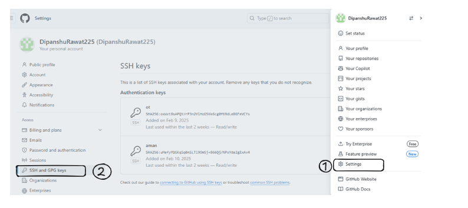
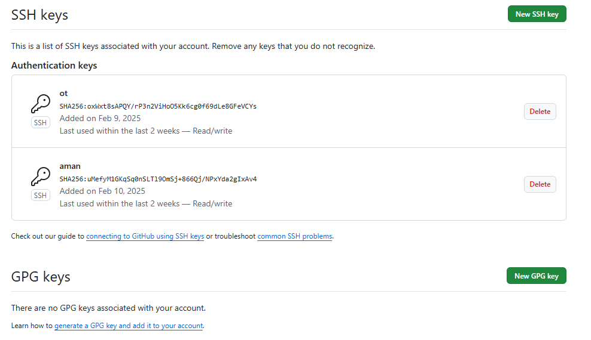
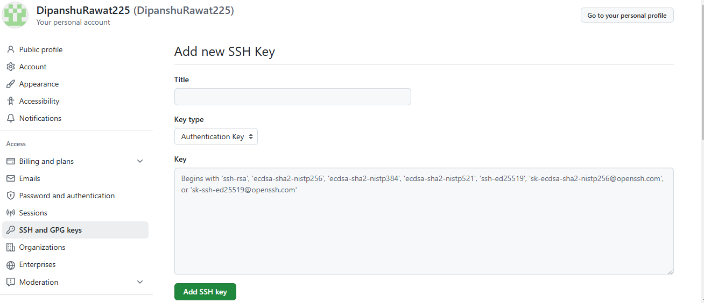
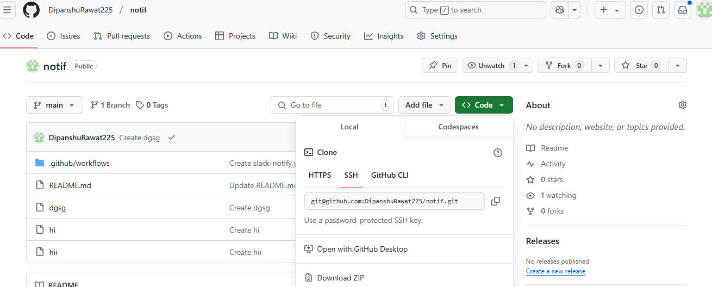

# **GitHub Setup installation guide**


| **Author** | **Created on** | **Version** | **Last updated by**|**Internal Reviewer** |**Reviewer L0** |**Reviewer L1** |**Reviewer L2** |
|------------|---------------------------|-------------|---------------------|-------------|-------------|-------------|-------------|
| Dipanshu Rawat|   18-02-2025             | v1          | Dipanshu Rawat        |  Siddharth Pawar |  |   |      |


# Table of Contents
1. [Introduction](#introduction)
2. [GIT](#git)
3. [GIT Setup Prerequisites](#git-setup-prerequisites)
4. [Git Installation on Ubuntu](#git-installation-on-ubuntu)
   - [Step 1: Update System Packages](#step-1-update-system-packages)
   - [Step 2: Installation of Git](#step-2-installation-of-git)
   - [Step 3: Verify the version of Git](#step-3-verify-the-version-of-git)
   - [Step 4: Configure Git on Ubuntu](#step-4-configure-git-on-ubuntu)
     - [1. Check the public key](#check-the-public-key)
     - [2. Create public key](#create-public-key)
     - [3. Copy the public key](#copy-the-public-key)
     - [4. Click on the Account setting](#go-to-the-account-setting)
     - [5. Add New SSH key](#add-new-ssh-key)
     - [6. Git clone](#git-clone)
5. [Contact Information](#contact-information)
6. [References](#references)


# Introduction

A Version Control System (VCS) is software that facilitates
collaborative work among software developers and enables them to
maintain a comprehensive history of their work.

# Git

Git is a distributed version control system that helps developers track
changes in their code, collaborate with others, and manage their source
code efficiently. It is widely used in software development to maintain
project history, resolve conflicts, and enable teamwork

# Git Setup Prerequisites

| **Requirement** | **Details**                                           |
|-----------------|-------------------------------------------------------|
| **OS**          | Ubuntu /Linux-based OS or Windows                     |
| **RAM**         | 1 GB minimum                                          |
| **Disk Space**  | 200 MB for Git installation                           |
| **Processor**   | Any modern processor (Intel or AMD, 1 GHz or faster). |

# Git Installation on Ubuntu

This guide provides the steps to install and configure GitHub on Ubuntu.

**Installation Steps**

## Step 1: Update System Packages

``` bash
sudo apt update
```


## Step 2: Installation of Git

**To install Git, use the apt package manager**

``` bash
sudo apt install git -y
```


## Step 3: Verify the version of Git
``` bash
git –version
```


## Step 4: Configure Git on Ubuntu

Before configuration on local machine of Git your account should be
available on GitHub website.


### Check the public key 

> Go to the ./ssh directory for check public key is available or not


**If the public key is not available, then create the key**

### Create public key

``` bash
ssh-keygen
```


### Copy the public key
copy the public key and go you github account on web browser and singnin. 


### Go to the Account Setting 

1) Go you account
2) Click on right side of your account setting
3) click on ssh and gpg key




### Add New SSH key

> Add ssh key by pressing new ssh key button




### Add the title name

Paste the ssh key in key box then click on add ssh key button



### Now click on your repo which want to clone on your local machine. Click on code 🡪 SSH 🡪 copy the code.




## Git Clone
**Go to your system and type or paste the code that you copied**


## Contacts

| Name| Email Address      | 
|-----|--------------------------|
| Dipanshu Rawat | dipanshu.rawat@mygurukulam.co |  

# References

| **Link** | **Description** |
|-----------------------------------|-------------------------------------|
| [Git installation on Ubuntu](https://www.digitalocean.com/community/tutorials/how-to-install-git-on-ubuntu) | GitHub installation |
| [GitHub SSH Configuraton](https://www.theserverside.com/blog/Coffee-Talk-Java-News-Stories-and-Opinions/GitHub-SSH-Key-Setup-Config-Ubuntu-Linux) | GitHub Configuration |
|[conclusion doc](https://github.com/avengers-p11/Documentation/tree/main/VCS%20Design%20%2B%20POC/Features%20of%20VCS/Conclusion%20doc)| why we choose GitHub |
